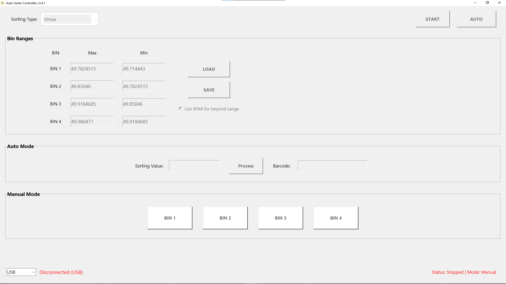

# 🌞 SimuSort

**SimuSort** is a smart solar module sorting interface designed for solar manufacturing lines. It seamlessly integrates with data from sun simulators (like G-Sola, GMEE Solar), allowing precise sorting based on electrical characteristics such as **Pmax**, **Isc**, **Vmax**, or **Imax**. Originally built to retrofit a **Jinchen Machinery Co., Ltd.** sorter, this system replaces missing original software with a modern, customizable, and easy-to-use solution.

> ⚠️ This is a custom-built solution not affiliated with the original sorter hardware vendor. It was developed for internal use in solar manufacturing facilities of [Icon Solar-En Power Technology Pvt. Ltd.](https://www.iconsolar-en.com) using G-Sola sun simulators.

> 🔧 Built in Python. Powered by CSV. Designed for [Icon Solar-En Power Technology Pvt. Ltd.](https://www.iconsolar-en.com)

---

## ⚡ Features

- 🔍 **Barcode-based auto-fill and processing** from CSV file
- 🎛️ **Bin Relay control** via USB or Ethernet (Arduino/relay compatible)
- 🔄 **Auto & Manual modes** for flexibility
- 📦 **Custom bin range configuration**
- 🔄 Automatically refreshes CSV data every second
- 📈 Automatic Detects **Min-Max Values**
- 💾 Save/load multiple sorting profiles
- ✅ Clean GUI interface with scalable DPI
- 📊 **Sorting based on**: Pmax, Isc, Imax, or Vmax
- 💡 Compatible with second-hand or retrofitted sorters
- 🧩 Supports 4-bin output with optional fallback to BIN 4 for unmatched data


---

## 🖼 GUI Preview

  
<sub><i>Dynamic, DPI-aware GUI with bin range editing, manual overrides, and auto barcode scan input.</i></sub>

---

## 📁 Project Structure

```
simusort/
├── src/
│   └── relay_control.py       ← main application logic
├── assets/
│   ├── config.json            ← user configuration file
│   └── icon.ico               ← application icon
├── tempData/
│   └── (auto-saved range files)
├── LICENSE                    ← Apache 2.0
├── NOTICE.txt                 ← attribution & ownership
├── README.md                  ← you're here!
├── requirements.txt           ← Python dependencies
└── .github/
    ├── workflows/ci.yml       ← GitHub Actions (optional)
```

---

## 🚀 Getting Started

### ✅ Prerequisites

- Python 3.8 or newer
- Modules:
  - `tkinter` (GUI)
  - `pyserial`
  - `socket`
  - `csv`, `json`, `threading`, etc. (standard libs)
- Hardware:
  - **Sorter**: Jinchen or any relay-based model (4-relay bin input)
  - **Simulator**: G-Sola Sun Simulator (CSV output)
  - **Microcontroller**: Arduino-based relay controller (USB or Ethernet)
- Windows 10 or 11 (recommended)

### 🔧 Installation

```bash
git clone https://github.com/MK-NAIK/simusort.git
cd simusort
pip install -r requirements.txt
python src/relay_control.py
```

> ⚠️ Make sure your `config.json` has the correct CSV path and column mapping.

---

## 🖥️ Usage

1. Connect your Arduino (USB or Ethernet).
2. Launch SimuSort.
3. Select connection type (USB/Ethernet).
4. Choose your sorting parameter (e.g. Pmax).
5. Define bin ranges (Min/Max per bin).
6. Toggle **Start** > then switch to **Auto** or **Manual**.
7. In Auto mode:
   - Scan barcode → SimuSort auto-triggers bin.
8. In Manual mode:
   - Enter test values or click BIN buttons to trigger.

---

## 🔗 Configuration

Edit `assets/config.json` to:
- Set USB vendor ID / product ID
- Choose Ethernet IP & port (for network mode)
- Update CSV file path and column mapping

**CSV Format Example** (from G-Sola):
| ... | Barcode | ... | Isc | Vmax | Imax | Pmax | ... |
|-----|---------|-----|-----|------|------|------|-----|

> The barcode scanner can be used in AUTO mode to instantly pull corresponding values and sort.


---

## 📦 Building Installer (Optional)

You can generate an `.exe` file using `pyinstaller`:

```bash
pip install pyinstaller
pyinstaller --onefile --icon=assets/icon.ico src/relay_control.py
```

Then bundle it using Inno Setup, NSIS, or any installer builder for Windows.

---

## 📄 License

Licensed under the **Apache License 2.0**.  
See [`LICENSE`](LICENSE) and [`NOTICE.txt`](NOTICE.txt) for full details.

---

## 💡 Future Improvements

- 👥 **Client Wise** and **Power Wise** module Binning*
- 📝 Bin wise **Report Generation**
- 🧪 Simulator-independent data capture using **Physical Buttons**
```

---

## 🧑‍💻 Author

**Mukesh Kumar Naik**  
R&D Engineer | Icon Solar En Power Tech. Pvt. Ltd.  
📧 MKNaik521@gmail.com  
🌐 [https://www.iconsolar-en.com](https://www.iconsolar-en.com)  
🐙 [github.com/MK-NAIK](https://github.com/MK-NAIK)

---

## 🤝 Contributing

Want to improve SimuSort?  
PRs and suggestions are welcome! Open issues, fork the repo, or reach out.


* Power Wise Binning: Different from Pmax, based on Model (520W, 590W, 450W)
  Client Wise Binning: same electrical parameters but for different clients
---